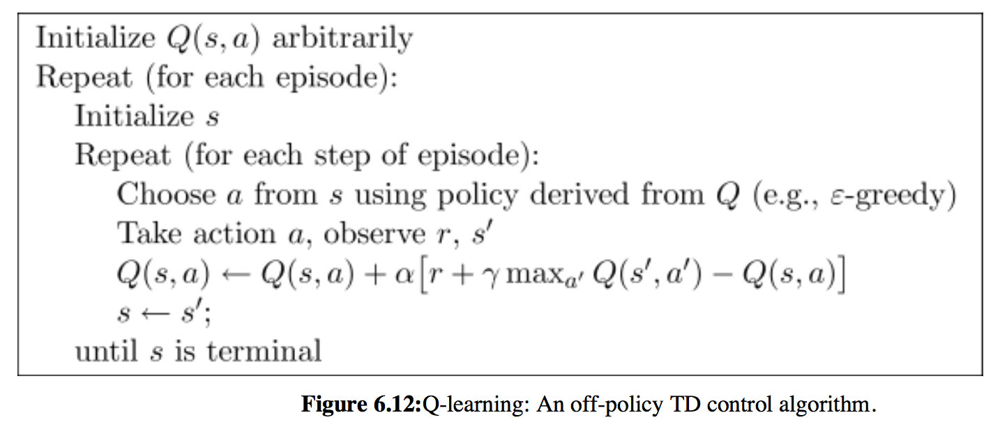

# [Q-Learning](#)
> Dec 16-23, 2017

## Concept
- **Q-table** store **rewards** for each state and action

| state        | action1       | action2   |
| ------------- |:-------------:| :--------:|
| **state1.**  | reward1		|reward2	|
| **state2.**  | reward3       |reward4    |
| **state3.**  | reward5       |reward6    |

- At begining of each state, choose action which has **highest reward** in this state
- After choosing the action , you'll get **reward and next state from environment**
- According to this feedback and current state, **update Q-table value** (which choosed at **state2**)
- the main process will play this game several times
- In each game, you will take actions and update Q-table several times, until you Win or Fail(Optional)
- Q-Table will be preserved in the end of each game, you can also think Q-Talbe as **global variable** in the main process, so it wont be initialized in the begining of each game.
- step is different from state, for exmaple, there may be several step with same state.(Think of Maze problem, a point as a state, and sometimes you will at same point in several steps.)

## Algorithm
 \
the basic Q-learning algorithm, there're two Loop in the algorithm. Outer one is for games(episode), and inner one is for state and actions (steps in a game). \

1. Initialize **Q-Table** (basically, set all reward = 0.0)
2. Loop setting for each game (episode) :
3. Initialize **state** in the begining of each games
4. Loop setting for each steps
5. According to state *s* in each step, pick the Action *a* with highest reward (greedy method)
	- **ε-greedy**(Epsilon greedy) : A reward choosing policy. *ε* is a rate value. If *ε* = 0.9, its means Agent will choose maximum reward action by 90%, and 10% choose randomly.
	- Also, you can take other policy to pick reward
6. Take action *a* and then observe the environment feedback ( reward *r'* and next step state *s'* )
7. **Update Q-Table's reward you picked** : 
	- alpha *α* : learning-rate
	- gamma *γ* : decay-rate
	- *max*Q(*s'*,*a'*) means : derive the highest reward *r'* in state *s'*
8. update state *s* to *s'*

## Reference
1. (video) Morvan's Q-Learning tutorial in chinese ([link](https://morvanzhou.github.io/tutorials/machine-learning/reinforcement-learning/2-2-tabular-q1/))
2. (video) How Q-table updates ([link](https://www.youtube.com/watch?time_continue=207&v=qz_4kDieX64))