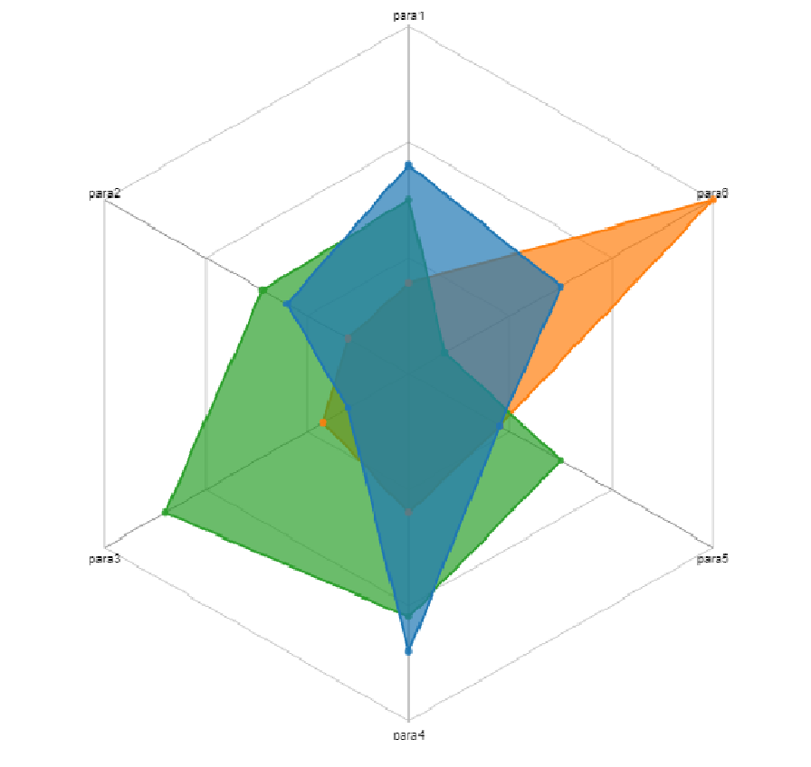

> Updated Dec 14, 2017

## **SAS Visual Analytics - customized chart**

### Usage：
- software : SAS VA 8.2+
- load chart's url with "Object > Other > Data Driven Content"

### Chart：

BubbleChart | BubbleMenuChart | DependencyWheelChart | RadarChart


For more details , see [SAS VA 8.2 - Data Driven Visualization (en)](http://go.documentation.sas.com/?cdcId=vacdc&cdcVersion=8.2&docsetId=varef&docsetTarget=n109mqtyl6quiun1mwfgtcn2s68b.htm&locale=en).


## **SAS Visual Analytics - 客製化圖表**

### 用法：
- 軟體 : SAS VA 8.2+
- 使用 “物件 > 其他 > 資料驅動內容” 載入圖表

### 圖表：

泡泡圖 | 泡泡類別圖| 相依輪型圖 | 雷達圖
------------ | ------------- | ------------ | -------------
[](./src/img/bubble.png) |  |  | 


更多的細節 , 請參考 [SAS VA 8.2 - Data Driven Visualization (zh-TW)](http://go.documentation.sas.com/?cdcId=vacdc&cdcVersion=8.2&docsetId=varef&docsetTarget=n109mqtyl6quiun1mwfgtcn2s68b.htm&locale=zh-TW)

```javascript
img_radar
```

